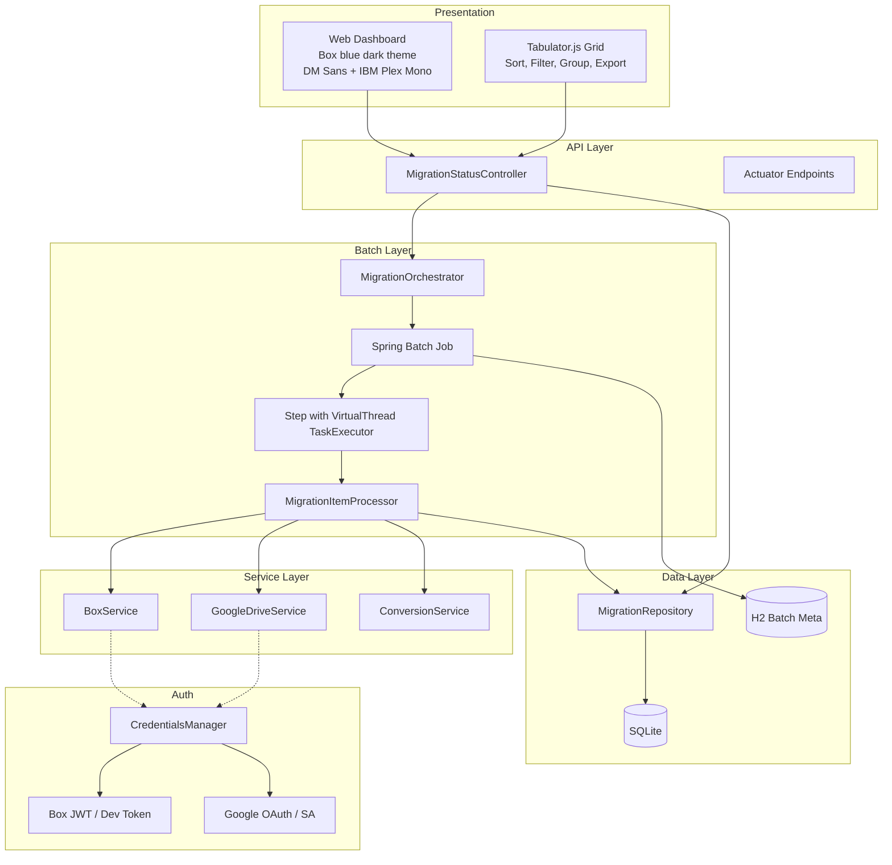

# Box to Google Drive Migration Tool - Project Summary

## Technology Stack

| Component | Technology | Version |
|-----------|-----------|---------|
| Language | Java (Virtual Threads) | 21+ |
| Framework | Spring Boot | 3.3.0 |
| Batch Processing | Spring Batch | 5.1.x (via Boot) |
| Batch Metadata | H2 (in-memory) | 2.2+ |
| Application Data | SQLite | 3.45.3.0 |
| Box SDK | Box Java SDK | 4.10.0 |
| Google Drive | Google Drive API v3 | 2.0.0 |
| CSV Parser | Apache Commons CSV | 1.10.0 |
| Frontend Grid | Tabulator.js | 6.3.1 |
| Logging | SLF4J + Logback | 2.0.13 / 1.5.6 |
| Monitoring | Spring Boot Actuator | 3.3.0 |

## Architecture Overview



## Key Design Decisions

| Decision | Rationale |
|----------|-----------|
| Spring Batch for orchestration | Declarative job/step model, restart semantics, chunk processing, built-in monitoring |
| H2 for batch metadata | Spring Batch requires a relational store; H2 in-memory avoids polluting the app DB |
| SQLite for application data | Lightweight, zero-config, file-based persistence for migration records |
| HikariCP pool size 1 | Single-connection pool with WAL mode and busy_timeout=5000ms for thread-safe SQLite access |
| Virtual threads (Java 21) | I/O-bound workload benefits from lightweight threads (thousands concurrent with minimal memory) |
| Tabulator.js for grid | Full-featured data grid without heavyweight frameworks (React, Angular) |
| Server-side + client-side export | Filtered exports use client-side Tabulator download; full exports use server-side streaming (500-record chunks to prevent OOM) |
| AtomicBoolean for migration start | compareAndSet prevents duplicate job launches from concurrent requests |
| JobOperator.stop() for stopping | Proper Spring Batch signaling for graceful job stop (finishes current file) |
| Decoupled conversion | Upload first, then convert via Google Drive API MIME type setting |

## REST API Endpoints

| Method | Path | Purpose |
|--------|------|---------|
| GET | `/api/status` | Aggregate stats (total, completed, failed, pending, active, progress %) and 15 most recent records |
| GET | `/api/records` | Paginated records with optional `status` and `search` filters |
| GET | `/api/records/export` | Full CSV export (server-side, no pagination limit) |
| GET | `/api/csv/current` | Info about the active CSV file (path, exists, source) |
| POST | `/api/csv/upload` | Upload CSV via multipart; parses, validates, inserts PENDING records |
| POST | `/api/migration/start` | Launch Spring Batch job asynchronously |
| POST | `/api/migration/stop` | Stop via `JobOperator.stop()` (graceful, finishes current file) |
| POST | `/api/database/reset` | Truncate all migration records (blocked while migration runs) |
| GET | `/actuator/health` | Spring Actuator health with details |
| GET | `/actuator/metrics` | Prometheus-ready metrics |

## Dashboard

Three-tab interface served at `http://localhost:8080`:

1. **Migration Tab** - CSV upload (drag-and-drop), start/stop controls, progress bar, stat cards, recent activity feed
2. **Database Tab** - Tabulator.js grid with column groups (Source, Conversion, Result, Timestamps), sorting, filtering, row selection, client-side and server-side CSV export, database reset
3. **API & Health Tab** - Actuator health status, metrics display

**Theming**: Box blue (#0061D5) accent on dark background (#0b1120), DM Sans body font, IBM Plex Mono for code/data.

## File Format Conversions

| Source Format | Google Format | Conversion Method |
|--------------|---------------|-------------------|
| .docx, .doc (Word) | Google Docs | Decoupled upload + MIME type |
| .xlsx, .xls (Excel) | Google Sheets | Decoupled upload + MIME type |
| .pptx, .ppt (PowerPoint) | Google Slides | Decoupled upload + MIME type |

## Migration States

```
PENDING --> IN_PROGRESS --> DOWNLOADING --> UPLOADING --> CONVERTING --> EXPORTING --> COMPLETED
                |               |              |              |              |
                +-------+-------+------+-------+------+-------+------+------+
                        |                                                    
                        v                                                    
                      FAILED                                                 
```

## Configuration Properties

```properties
# Box Authentication
box.config.file=            # JWT config JSON (production)
box.developer.token=        # Dev token (testing, 60 min expiry)
box.as.user.id=             # Act-as user for service account

# Google Authentication
google.auth.type=           # "oauth" or "service_account"
google.credentials.file=    # OAuth client or service account JSON
google.application.name=    # Application name for API calls
google.impersonate.user=    # Domain user to impersonate (service account only)

# Application
db.path=./migration-results.db
csv.input.path=./input.csv
thread.pool.size=100
thread.pool.max.size=500
retry.max.attempts=3
retry.delay.seconds=5

# Spring Boot
server.port=8080
spring.threads.virtual.enabled=true
spring.batch.job.enabled=false
spring.batch.jdbc.initialize-schema=always
management.endpoints.web.exposure.include=health,info,metrics,prometheus
management.endpoint.health.show-details=always
```

## Performance Characteristics

| Metric | Value |
|--------|-------|
| Concurrent files | 100-500+ (virtual threads) |
| Memory per thread | ~Few KB |
| Throughput | 50-200+ files/min (network dependent) |
| Base memory | ~150 MB |
| DB record size | ~1 KB per record |

## Security Notes

- Credentials files (`.json`) excluded via `.gitignore`
- Developer tokens expire in 60 minutes; use JWT for production
- Service account requires domain-wide delegation for multi-user
- SQLite database contains file IDs and paths; treat as sensitive
- Uploaded CSVs stored in `./uploads/` directory
- **XSS protection**: `escapeHTML()` applied to all user-sourced data rendered in dashboard innerHTML
- **Path traversal protection**: CSV upload filenames sanitized with `Paths.get(name).getFileName()` to prevent directory traversal
- **Null-safe updates**: COALESCE on all metadata fields in ON CONFLICT UPDATE prevents null overwrites
- **Database reset guard**: checks `orchestrator.isRunning()` as additional safety before clearing records
