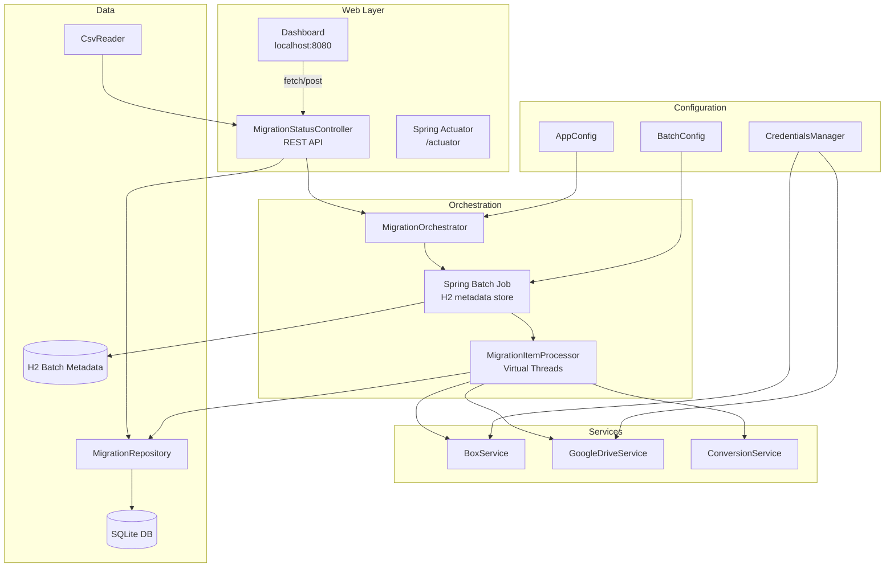
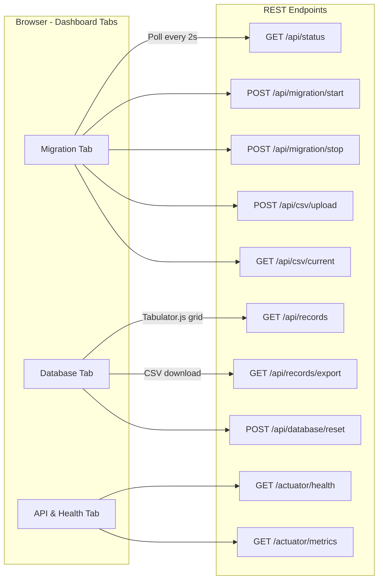

# Box to Google Drive Migration Tool

A Spring Boot 3.3.0 application that migrates files from Box.com to Google Drive with automatic format conversion from Microsoft Office formats to Google Workspace formats. Features a web dashboard, Spring Batch orchestration, and Java 21 virtual threads for high-throughput parallel processing.

## Architecture



## Migration Flow

```mermaid
sequenceDiagram
    participant User
    participant Dashboard
    participant Controller
    participant Orchestrator
    participant SpringBatch
    participant Processor
    participant Box
    participant Google

    User->>Dashboard: Upload CSV / Start Migration
    Dashboard->>Controller: POST /api/csv/upload
    Controller->>Controller: Parse CSV, insert PENDING records
    Dashboard->>Controller: POST /api/migration/start
    Controller->>Orchestrator: startMigration()
    Orchestrator->>SpringBatch: Launch Job (async)
    
    loop Each file (virtual threads)
        SpringBatch->>Processor: process(MigrationRecord)
        Processor->>Box: Download file
        Box-->>Processor: File bytes
        Processor->>Google: Create folder structure
        Processor->>Google: Upload + convert
        Google-->>Processor: Google Drive file ID
        Processor->>Processor: Update record COMPLETED
    end

    Dashboard->>Controller: GET /api/status (polling)
    Controller-->>Dashboard: Stats + recent records
```

## Dashboard Request/Response Flow



## Features

- **Spring Batch orchestration** with H2 metadata store for job tracking
- **Java 21 virtual threads** for lightweight, high-throughput concurrency (100-500+ concurrent files)
- **Web dashboard** at `http://localhost:8080` with real-time status polling
- **Tabulator.js database browser** with sorting, filtering, column grouping, and CSV export
- **CSV upload** with drag-and-drop from the dashboard
- **Migration stop** via Spring Batch JobOperator
- **Database reset** to clear all records
- **Format conversion**: Word, Excel, PowerPoint to Google Docs, Sheets, Slides (decoupled export)
- **Folder structure preservation** from Box to Google Drive
- **Resume capability** via SQLite state tracking
- **Duplicate detection** prevents re-uploading existing files
- **Spring Boot Actuator** for health checks and metrics

### Authentication

| Provider | Method | Use Case |
|----------|--------|----------|
| Box | JWT Config | Production (auto-refreshing tokens) |
| Box | Developer Token | Testing (expires in 60 minutes) |
| Google | OAuth 2.0 | Personal accounts (no Workspace needed) |
| Google | Service Account | Google Workspace with domain-wide delegation |

## Prerequisites

- **Java 21+** (required for virtual threads)
- Maven 3.6+
- Box.com account with API access
- Google Cloud project with Drive API enabled

## Quick Start

```bash
# Build
mvn clean package

# Run
java -jar target/box-google-converter-1.0-SNAPSHOT.jar

# Or run with Maven
mvn spring-boot:run
```

**Note**: The application uses HikariCP for SQLite connection pooling (pool size 1 with WAL mode) to ensure thread-safe database access from virtual threads.

Open `http://localhost:8080` to access the dashboard.

### Configuration

Edit `src/main/resources/application.properties`:

```properties
# Box - Choose ONE:
box.config.file=/path/to/box_config.json       # JWT (recommended)
# box.developer.token=YOUR_TOKEN               # Testing only

# Box As-User (optional, for JWT service account impersonation)
box.as.user.id=YOUR_BOX_USER_ID

# Google - Choose ONE:
google.auth.type=oauth                          # Personal account
# google.auth.type=service_account              # Workspace
google.credentials.file=/path/to/credentials.json
google.application.name=Box-Google-Converter
# google.impersonate.user=user@domain.com       # Service account only

# Database
db.path=./migration-results.db

# Virtual Threads
thread.pool.size=100

# CSV Input
csv.input.path=./input.csv

# Retry
retry.max.attempts=3
retry.delay.seconds=5
```

### CSV Input Format

**Simplified (recommended):**
```csv
box_file_id,user_email
123456789,user@example.com
987654321,user@example.com
```

**With explicit paths:**
```csv
box_file_id,box_file_path,user_email
123456789,/Marketing/Q1,user@example.com
```

## REST API

| Method | Endpoint | Description |
|--------|----------|-------------|
| GET | `/api/status` | Migration stats and recent records |
| GET | `/api/records` | Paginated records (params: `page`, `size`, `status`, `search`) |
| GET | `/api/records/export` | CSV export of all records |
| GET | `/api/csv/current` | Current CSV file info |
| POST | `/api/csv/upload` | Upload CSV (multipart form) |
| POST | `/api/migration/start` | Start batch migration job |
| POST | `/api/migration/stop` | Stop running migration gracefully via JobOperator.stop() |
| POST | `/api/database/reset` | Clear all migration records |
| GET | `/actuator/health` | Spring Actuator health |
| GET | `/actuator/metrics` | Spring Actuator metrics |

## Web Dashboard

The dashboard at `http://localhost:8080` has three tabs:

1. **Migration** - Start/stop migrations, upload CSV, view progress stats and recent activity
2. **Database** - Tabulator.js grid with sortable columns, filtering, column groups (Source, Conversion, Result, Timestamps), client-side filtered export and server-side full export
3. **API & Health** - Actuator health and metrics display

**Design**: Box blue (#0061D5) themed dark UI with DM Sans and IBM Plex Mono typography.

## Database Schema

SQLite database (`migration-results.db`):

```sql
CREATE TABLE migration_records (
    id INTEGER PRIMARY KEY AUTOINCREMENT,
    box_file_id TEXT NOT NULL UNIQUE,
    box_file_path TEXT NOT NULL,
    box_file_name TEXT NOT NULL,
    user_email TEXT NOT NULL,
    google_drive_file_id TEXT,
    google_drive_path TEXT,
    google_drive_web_view_link TEXT,
    status TEXT NOT NULL,
    error_message TEXT,
    original_format TEXT,
    converted_format TEXT,
    file_size_bytes BIGINT,
    created_at TIMESTAMP DEFAULT CURRENT_TIMESTAMP,
    updated_at TIMESTAMP DEFAULT CURRENT_TIMESTAMP,
    completed_at TIMESTAMP
);
```

**Statuses**: `PENDING`, `IN_PROGRESS`, `DOWNLOADING`, `UPLOADING`, `CONVERTING`, `EXPORTING`, `COMPLETED`, `FAILED`

## Project Structure

```
src/main/java/com/migration/
  Main.java                          # @SpringBootApplication entry point
  MigrationRunner.java               # CommandLineRunner (init DB, keep server alive)
  config/
    AppConfig.java                   # @Value-based configuration properties
    BatchConfig.java                 # Spring Batch Job/Step/Reader/Writer/TaskExecutor
    CredentialsManager.java          # Box JWT/Token + Google OAuth/ServiceAccount
  controller/
    MigrationStatusController.java   # All REST endpoints
  service/
    MigrationOrchestrator.java       # Launches/stops Spring Batch jobs
    BoxService.java                  # Box API operations
    GoogleDriveService.java          # Google Drive API operations
    ConversionService.java           # Upload and convert to Google format
  processor/
    MigrationItemProcessor.java      # Spring Batch ItemProcessor (per file)
  repository/
    MigrationRepository.java         # SQLite CRUD with pagination/filtering
  model/
    MigrationRecord.java             # Migration record entity
    MigrationStatus.java             # Status enum
    FileConversionMapping.java       # Office-to-Google MIME mapping
    ConversionResult.java            # Conversion result model
  util/
    CsvReader.java                   # CSV parsing

src/main/resources/
  static/index.html                  # Dashboard (Tabulator.js, Box blue theme)
  banner.txt                         # Custom Box ASCII art startup banner
  application.properties             # Configuration
  logback.xml                        # Logging configuration
```

## Setup Guides

- [OAUTH_SETUP.md](OAUTH_SETUP.md) - Google OAuth for personal accounts (5 min)
- [SETUP_GUIDE.md](SETUP_GUIDE.md) - Full setup including Box JWT and Google Service Account
- [GOOGLE_CLOUD_SETUP_COMPARISON.md](GOOGLE_CLOUD_SETUP_COMPARISON.md) - Compare Google auth options

## Troubleshooting

| Error | Solution |
|-------|----------|
| Box credentials not configured | Set `box.config.file` or `box.developer.token` in properties |
| Google credentials file not configured | Set `google.credentials.file` to valid JSON path |
| File already exists at destination | By design (no overwrite). Remove from Drive or skip in CSV |
| Failed to download from Box | Verify file ID exists and app has read permissions |
| Security error uploading | Check domain-wide delegation and OAuth scopes |

## License

Proprietary migration tool. All rights reserved.
